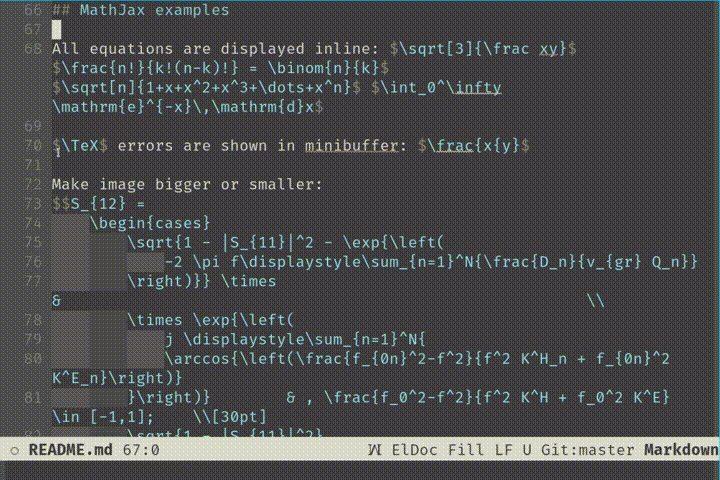

`math-preview` uses [MathJax](https://www.mathjax.org/) for displaying TeX math inline in Emacs
buffers.



## Installation

`math-preview` requires external nodejs program `math-preview`.

It may be installed by issuing the command:

```bash
> npm install -g git+https://gitlab.com/matsievskiysv/math-preview
```

If you don't have `npm` installed, get it from [`asdf`](https://github.com/asdf-vm/asdf-nodejs) or
[`nvm`](https://github.com/nvm-sh/nvm).

Make sure that `math-preview` is in you `PATH`.

Install companion package in Emacs:

<kbd>M-x</kbd>+<kbd>package-install</kbd>+<kbd>math-preview</kbd>

If `math-preview` is not in your path, then you need to set variable `math-preview-command`
to the location of the program:
<kbd>M-x</kbd>+<kbd>customize-variable</kbd>+<kbd>math-preview-command</kbd>.

Or if you use `use-package`, just add the following command:

```elisp
(use-package math-preview
  :custom (math-preview-command "/path/to/math-preview"))
```

## Functions

|   |   |
|:--|:--|
| `math-preview-all` | Preview equations in buffer |
| `math-preview-region` | Preview equations in selected region |
| `math-preview-at-point` | Preview equation at current position |
| `math-preview-clear-all` | Clear equation images in buffer |
| `math-preview-clear-region` | Clear equation images in selected region |
| `math-preview-clear-at-point` | Clear equation image at current position |
| `math-preview-increment-scale` | Enlarge equation image at point |
| `math-preview-decrement-scale` | Shrink equation image at point |
| `math-preview-copy-svg` | Copy SVG code to clipboard |
| `math-preview-stop-process` | Stop child process |

## Key bindings

`math-preview` does not add any keybindings to global keymap.
However, it adds a number of keybindings to the image overlay, which become active when your cursor
is on the image.

|   |   |
|:--|:--|
| `math-preview-clear-at-point` | <kbd>Del</kbd>; <kbd>Backspace</kbd>; <kbd>Space</kbd>; <kbd>Enter</kbd>; <kbd>mouse-1</kbd> |
| `math-preview-clear-all` | <kbd>Ctrl</kbd>+<kbd>Del</kbd>; <kbd>Ctrl</kbd>+<kbd>Backspace</kbd>; <kbd>Ctrl</kbd>+<kbd>mouse-1</kbd> |
| `math-preview-increment-scale` | <kbd>+</kbd>; <kbd>p</kbd> |
| `math-preview-decrement-scale` | <kbd>-</kbd>; <kbd>n</kbd> |
| `math-preview-copy-svg` | <kbd>Ctrl</kbd>+<kbd>Backspace</kbd>; <kbd>Ctrl</kbd>+<kbd>Space</kbd>; <kbd>mouse-3</kbd> |


## MathJax extension libraries

MathJax provides additional functionality via extension libraries.
They are enabled by the `\require` macro.

For example:

```latex
\(\require{\mhchem} \require{enclose} \enclose{circle}{\ce{H2O}}\)
```

Get full list of available extensions
[here](http://docs.mathjax.org/en/latest/input/tex/extensions/).
